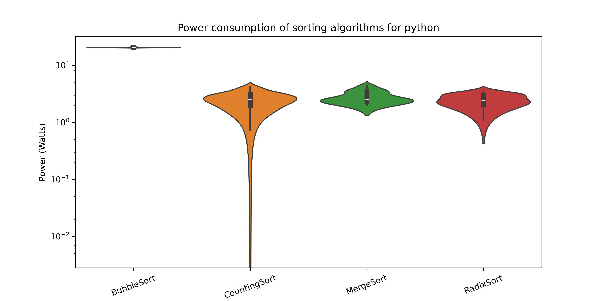
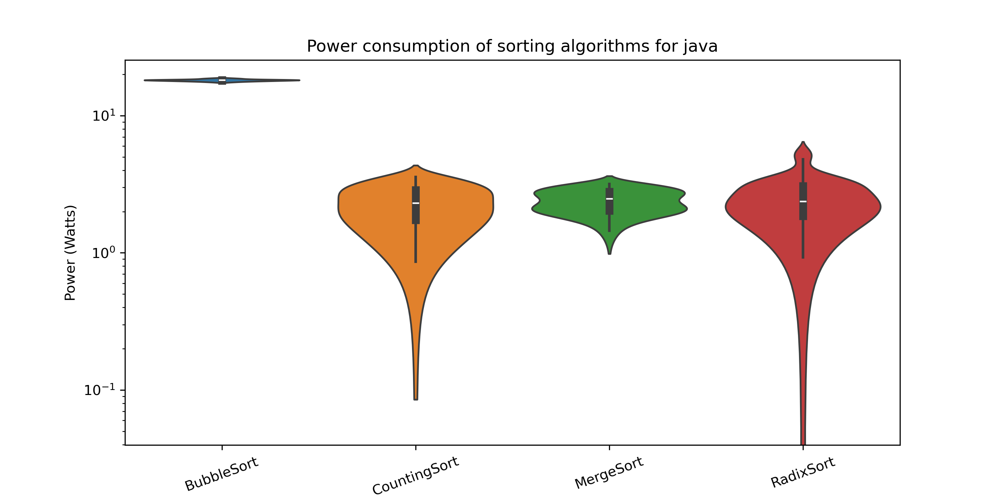
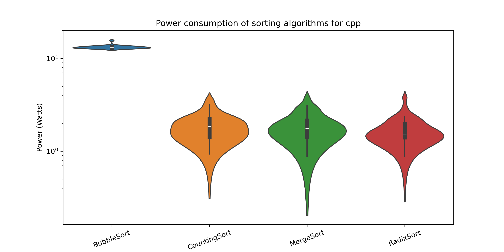
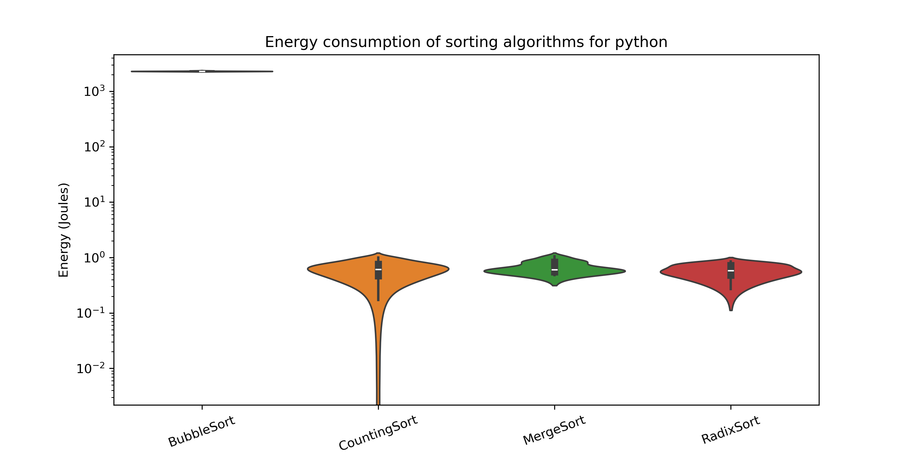
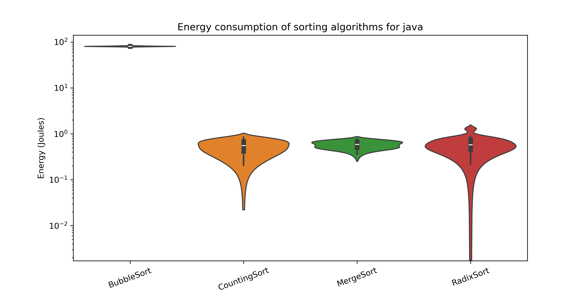
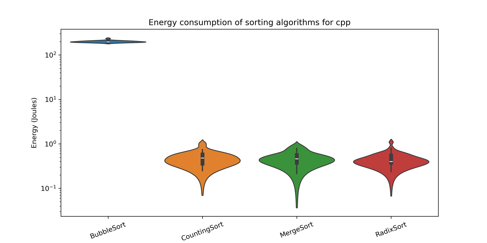
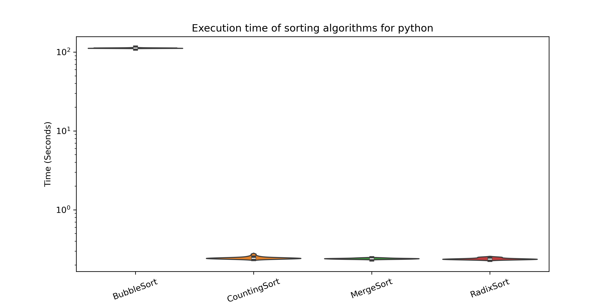
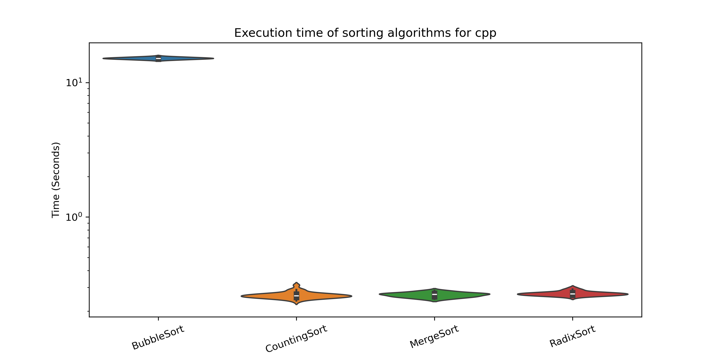

# Monitoring energy consumption for sorting algorithms in Java, C++ and Python

## Introduction  

Sorting algorithms come in all shapes and sizes, from highly efficient to not-so-efficient. They’re usually judged based on their time and space complexity, but their energy consumption is rarely considered. However, evaluating the energy consumption of a sorting algorithm is important. While sorting a single array might not use much energy, the countless times sorting is performed in a program can add up, potentially making a noticeable impact on overall energy usage. This is particularly relevant in large-scale applications, data centers, and embedded systems where power efficiency is a critical concern.

In this report, we take a different approach by evaluating sorting algorithms based on their energy consumption. To make things more interesting, we also compare how they perform across three widely used programming languages: Python, C++, and Java. Each of these languages has different execution models and levels of optimization, which may influence energy efficiency. Python, being an interpreted language, may exhibit different energy characteristics compared to C++ and Java, which are compiled and often optimized at runtime.

The sorting algorithms covered in this report are:  

- **Bubble Sort**, which has a complexity of $O(n^2)$, is a simple but inefficient algorithm that repeatedly swaps adjacent elements until the list is sorted.
- **Radix Sort**, which has a complexity of $O(nk)$, is a non-comparative sorting algorithm that sorts numbers digit by digit.
- **Merge Sort**, which has a complexity of $O(n \log n)$, is a divide-and-conquer algorithm that recursively splits an array into smaller subarrays and merges them in sorted order.
- **Counting Sort**, which has a complexity of $O(n + k)$, is an integer-based sorting algorithm that works well when the range of input values is small compared to the number of elements.

We have chosen these algorithms because they each have a different complexity, which may be an important factor in their energy consumption. Algorithms with higher time complexity often require more computations, leading to increased power usage. By analyzing the energy efficiency of these sorting algorithms across different programming languages, we aim to provide insights that go beyond traditional complexity analysis. This study can help developers make informed decisions when choosing a sorting algorithm, especially in applications where power efficiency is a key consideration, such as mobile devices, or devices which are not connected to the power grid and so, have only limited a limitted amount of energy. 

The replication package for this experiment can be found at our public [GitHub repository](https://github.com/MartijnFr/SSE-21-1). In the README.md you can find the steps and prerequisites to run the experiment.

## Methodology
This study aims to measure and compare the energy consumption of different sorting algorithms implemented in three widely used programming languages: Python, Java, and C++. In this experiment, we focus on four common sorting algorithms: Bubble Sort, Counting Sort, Merge Sort, and Radix Sort. The energy consumption and execution times of each algorithm were measured 30 times under controlled conditions to ensure the results' accuracy and consistency.

### Hardware and Software configurations
The experiments were conducted on a laptop running Windows 11 with the following hardware specifications:
- **Processor:** Intel 13th generation i7  
- **Memory:** 32 GB LPDDR5  
- **Graphics Card:** NVIDIA GeForce 4060

For power measurement and data collection, we used Energibridge and LibreHardwareMonitor. These tools were selected for their accuracy in tracking power consumption at both the system and CPU levels. The specific versions used were:
- **Energibridge v0.0.7**  
- **LibreHardwareMonitor v0.9.4** 

### Preparations
Before beginning the experiments, we took several precautions to ensure the integrity of the results. We first implemented the sorting algorithms for each of the three languages. To maintain consistency across all measurements, each algorithm was tested on the same array containing 50,000 random integers. This dataset size was chosen to be large enough to observe significant differences in energy consumption without being excessively time-consuming.

To eliminate any potential external influences on power consumption, we made several adjustments to the laptop used for the experiment. Flight mode was enabled to disable Wi-Fi and Bluetooth, preventing background network activity that could skew the results. Furthermore, we ensured that no unnecessary applications were running during the experiments, reducing CPU usage from unrelated processes. Lastly, the laptop remained connected to a charger throughout the experiments to ensure stable power supply and prevent power fluctuations that could have affected the measurements when operating on battery power.

### Experiment and Data collection
Once the preparations were completed and potential disruptions were mitigated, we proceeded with collecting the data. Each sorting algorithm was executed 30 times for each programming language to ensure statistically meaningful results. After each execution, the results were recorded using LibreHardwareMonitor, which tracked real-time power consumption in watts. The data collected was stored in a file for further analysis.

For detailed energy measurements, we used the `--summary` option of Energibridge, which provided an immediate summary of energy consumption in joules and execution times in seconds. This allowed us to analyze both the execution time and the energy consumption during the execution of the algorithms. By running each algorithm multiple times and recording the results in this manner, we ensured that any outliers or anomalies were minimized, giving us reliable and reproducible data for comparison.

## Results

The objective of this study was to measure and compare the power consumption, energy consumption, and execution time of four sorting algorithms—Bubble Sort, Counting Sort, Merge Sort, and Radix Sort—implemented in Python, Java, and C++. Each algorithm was executed on datasets of the same size 50000 to ensure consistent comparisons. The metrics analyzed include **power consumption**, **energy consumption**, and **execution time**. Below, we present the findings for each language and metric.

---

### Power Consumption Across Languages

Power consumption refers to the instantaneous rate of energy usage during the execution of the algorithms. The following graphs summarize the power consumption of the four sorting algorithms in Python, Java, and C++:

- **Graph 1**: 
    - In Python, Bubble Sort exhibited the highest power consumption due to its quadratic time complexity. Counting Sort, Merge Sort and Radix Sort showed lower power consumption, likely because they involve fewer comparisons but may require additional memory allocation.

- **Graph 2**: 
    - Java's Just-In-Time (JIT) compiler optimized the execution of Merge Sort, resulting in lower power consumption compared to Bubble Sort, Radix Sort and Counting Sort. The garbage collection mechanism in Java introduced some variability in power usage, particularly for larger datasets.

- **Graph 3**: 
    - C++ demonstrated the lowest overall power consumption among the three languages. This is attributed to its low-level nature and efficient memory management. Radix Sort performed exceptionally well in C++, consuming significantly less power than the other sorting algorithms.

---

### Energy Consumption Across Languages

Energy consumption represents the total amount of energy used during the execution of the algorithms. The following graphs summarize the energy consumption of the four sorting algorithms in Python, Java, and C++:

- **Graph 4**: 
    - Python consumed the most energy across all algorithms, with Bubble Sort being the least efficient. Counting Sort, Merge Sort and Radix Sort showed moderate energy consumption, but their memory requirements slightly increased the overall energy usage.

- **Graph 5**: 
    - Java consistently demonstrated the lowest energy consumption for all algorithms. Counting Sort, Merge Sort and Radix Sort were more energy-efficient than Bubble Sort, primarily due to their better time complexity and optimization by the JIT compiler.

- **Graph 6**: 
    - C++'s energy consumption fell between Python and Java. Radix Sort stood out as the most energy-efficient algorithm in C++, thanks to its linear time complexity for certain types of data.

---

### Execution Time Across Languages

Execution time measures the duration taken by each algorithm to complete the sorting task. The following graphs summarize the execution time of the four sorting algorithms in Python, Java, and C++:

- **Graph 7**: 
    - Python had the longest execution times for all algorithms, with Bubble Sort being the slowest. Counting Sort, Merge Sort and Radix Sort performed better due to their optimized logic but the interpreted nature of Python limited their speed.

- **Graph 8**: 
    - Java's achieved the shortest execution times for all algorithms, with Counting Sort being the fastest. Merge Sort and Radix Sort showed significant improvements over Bubble Sort, highlighting the benefits of optimized algorithms in compiled languages.

- **Graph 9**: 
    - C++'s execution times were shorter than Python's but longer than Java's. This result aligns with C++'s reputation for high performance and efficient resource utilization.

---

### Key Findings

- **Overall Performance**: Java demonstrated the best balance between power consumption, energy efficiency, and execution time, primarily due to its JIT compiler optimizations. C++ followed closely behind, while Python lagged due to its runtime overhead.
- **Bubble Sort Inefficiency**: Across all languages, Bubble Sort was the least efficient algorithm, consuming the most energy and taking the longest execution time. Its quadratic time complexity made it unsuitable for large datasets.
- **Counting Sort Superiority**: Counting Sort outperformed the other algorithms in execution time across all languages, especially in Java and C++. However, its memory overhead made it slightly less energy-efficient in Python.
- **Radix Sort and Merge Sort Balance**: Both Radix Sort and Merge Sort achieved a good balance of execution time and energy consumption, making them strong candidates for efficient sorting.
- **Language Efficiency**: Java's JIT compiler optimizations gave it a significant performance boost over C++, while C++'s lower-level nature ensured stable and efficient execution. Python's interpreted execution and runtime overhead made it the least efficient of the three languages.

These findings highlight the importance of choosing the right programming language and algorithm for energy-efficient and high-performance computing.

## Conclusion

This study reveals the significant impact of programming language and algorithm choice on energy consumption and execution efficiency. Among the three languages tested, Java consistently showed the best performance in terms of energy consumption, power usage, and execution time, thanks to its Just-In-Time (JIT) compilation and optimization techniques. C++ followed closely behind, benefiting from its low-level control over resources and efficient memory management, while Python's interpreted nature led to higher energy usage and longer execution times across all sorting algorithms.

Of the sorting algorithms tested, **Bubble Sort** proved the least efficient, exhibiting the highest energy consumption and the longest execution times. On the other hand, **Counting Sort** performed exceptionally well in execution time, particularly in Java and C++, although its memory requirements made it less energy-efficient in Python. **Radix Sort** and **Merge Sort** offered a balanced performance, making them viable choices for applications where both time and energy efficiency are critical.

Ultimately, the results underscore the importance of considering both algorithmic complexity and language-specific optimizations when developing applications, especially in energy-conscious environments like mobile or embedded systems.

## Discussion

The findings of this study provide useful insights for developers and system designers who must make decisions about algorithm selection and programming language choice. For applications where performance and energy efficiency are crucial, Java stands out due to its JIT compiler optimizations, providing a good balance between execution speed and energy consumption. C++ is also an excellent choice, especially for performance-sensitive applications, thanks to its low-level nature and memory management capabilities. Python, while being a popular language for rapid development, may not be the best choice for energy-constrained environments due to its interpreted execution model.

The inefficiency of Bubble Sort across all languages highlights the need to avoid using simple algorithms with high time complexities in large-scale applications. Instead, algorithms like Counting Sort, Radix Sort, and Merge Sort, which have better time complexity, should be prioritized for applications requiring efficiency in both energy and performance.

## Future work

This study provides a valuable comparison of energy consumption and performance across different sorting algorithms in three programming languages. However, several aspects remain open for further investigation.

First, expanding the range of sorting algorithms tested would provide a broader perspective on the energy and performance trade-offs. Algorithms such as Quick Sort, Heap Sort, and Tim Sort could be included to further refine the analysis, especially in terms of average and worst-case performance.

Additionally, we only experimented on a single processor, GPU and operating system. Testing on different processors, GPUs and operating systems could yield more comprehensive insights into how different architectures could influence the energy consumption.

Another direction for future work is to explore the impact of language-specific optimization techniques further. Investigating additional Java features, such as garbage collection tuning, or delving into C++ compiler optimizations and memory management strategies could reveal ways to further enhance energy efficiency.

Finally, implementing real-world applications and workloads that involve repeated sorting could help evaluate long-term energy usage more effectively, providing a more realistic understanding of algorithmic efficiency in production environments.

